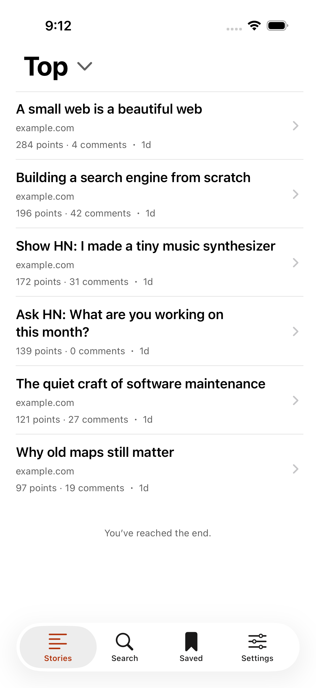
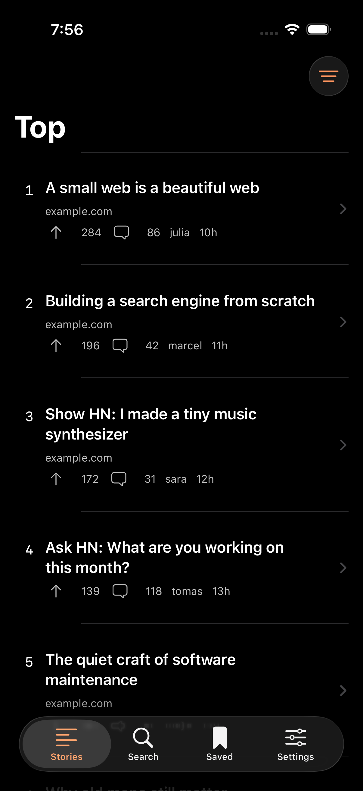

# Ember

A minimal native Hacker News reader for iPhone and iPad. Swift 6, SwiftUI, iOS 17+. No packages, backend, advertisements, or analytics.

**Status:** Private TestFlight **1.0.0 (4.1.0)** is processed by Apple and available to Max's internal group. This update includes historical periods, additional HN feeds, pinned typography previews, and refined comment reading. [Native iPhone/iPad review and screenshots](docs/review/READING-CONTROLS.md) · [Signed build and upload](https://github.com/yaportmax/ember-hacker-news/actions/runs/34743384480) · [TestFlight setup](Release/TESTFLIGHT.md).

## Actual app screenshots

Captured from the running native app in GitHub-hosted iPhone and iPad simulators. These use deterministic test stories; normal launches load live Hacker News data.

| Light | Dark |
| --- | --- |
|  |  |

[Reading controls and feed review](docs/review/READING-CONTROLS.md) · [Earlier iPhone and iPad screenshots](docs/SCREENSHOTS.md) · [Earlier design review](docs/review/AUDIT.md)

## Open and run

1. Open **Ember.xcodeproj** in Xcode 26 or later.
2. Select the **Ember** scheme and an installed iPhone or iPad simulator.
3. Press **Run**. The simulator needs no signing team or API keys.

Max can install the configured build through TestFlight. To run a fork on your own physical device, select your Apple Developer team in Signing & Capabilities and set your own bundle ID in `Config.xcconfig`. Do not open the Swift package to run the iOS app; the package exists for portable core tests.

## Included

- Top, New, Best, Ask HN, Show HN, and Jobs, in official HN order.
- Historical periods from today through all time, including custom dates; points or date ranking by feed.
- Thirteen additional native HN lists, including Best Comments with a 24-hour, 48-hour, or week window.
- Pull to refresh, explicit pagination, cached feeds, and retryable errors.
- Algolia search, relevance/recent sorting, and date filters.
- Native HTML comments, independent links, full discussion loading, tap-to-collapse threads, and a floating next-comment arrow.
- Independent story/comment fonts, text sizes, and spacing, with a pinned live preview.
- Poll results, author profiles, blocking, hidden stories, and reporting links.
- Persistent bookmarks and the last 500 opened stories. Search saved titles and domains.
- In-app Safari with Reader where supported, or your default browser.
- Native sharing, local deep links (`emberhn://item/123`), and comment-link resolution to the parent story.
- Light, dark, and system themes; compact rows; dim/hide read stories; Dynamic Type and VoiceOver labels.
- iPad layouts, multitasking-compatible sizing, and rotation support.
- Three icon variants, launch appearance, privacy manifest, Xcode scheme, tests, CI, and release tooling.

Voting, posting, replies, and sign-in use the official Hacker News website. Its public API has no supported authenticated write endpoints. Ember never handles HN credentials. Native bookmarks are independent of HN favorites. External articles and comment trees are **not** downloaded for offline reading; cached feeds and saved story details/post text are available offline.

## Test

```sh
swift test -j 1
```

This runs the portable model, HTML, networking, persistence, and state tests. The live API test is opt-in:

```sh
EMBER_LIVE_TESTS=1 swift test -j 1 --filter LiveAPITests
```

On a Mac with Xcode 26+ and both an iPhone and iPad simulator installed:

```sh
python3 scripts/release.py validate
```

This runs unit and UI tests on iPhone, UI tests on iPad, a Release build for a physical iOS device without signing, and static project checks. Results are stored in `build/`. It writes a validation receipt only after all steps succeed. Optional `--iphone` and `--ipad` arguments select simulator UDIDs explicitly.

For everyday private testing, **TestFlight upload** runs quick core/live API checks, builds and signs Release once, and uploads it to the internal group. It runs on main-branch code pushes or manually. Signing credentials are stored in GitHub Secrets. See [TestFlight setup](Release/TESTFLIGHT.md).

The full **iOS validation** workflow is manual: it runs iPhone/iPad UI tests and exports screenshots when a detailed review is needed. Debug UI tests use synthetic fixtures only with `--ui-testing`; normal launches use live APIs and Release excludes fixtures. Full validation receipts and screenshots remain separate from the quick TestFlight upload record.

## Prepare a release

```sh
python3 scripts/release.py configure \
  --bundle-id YOUR.REVERSE.DNS.ID \
  --team YOUR_TEAM_ID \
  --support-url https://YOUR_DOMAIN/ember/support.html \
  --privacy-url https://YOUR_DOMAIN/ember/privacy.html \
  --support-email YOUR_SUPPORT_EMAIL \
  --publisher "YOUR_PUBLISHER_NAME"

python3 scripts/release.py validate
python3 scripts/release.py archive
```

The configure command validates inputs and renders privacy/support pages into `Release/Web/`. Publish those two pages at the configured URLs. The archive command requires completed configuration and a passing validation receipt for the current source, then makes an archive and exports an IPA. It does **not** upload or publish. See `Release/PUBLISHING.md` for App Store Connect steps and content review requirements.

## Structure

| Directory | Contents |
| --- | --- |
| `Ember/Core` | Codable models, safe HTML renderer, HN/Algolia client, atomic storage |
| `Ember/State` | Main-actor observable models, pagination, comment tree, local collections |
| `Ember/Views` | SwiftUI screens and native Safari wrapper |
| `Ember/App` | App entry, dependency container, Debug-only UI fixtures |
| `EmberTests` | Portable XCTest suite, HTTP stubs, opt-in live tests |
| `EmberUITests` | Simulator navigation, persistence, offline, accessibility, screenshots |
| `Release` | Store listing, privacy/support pages, release checklist, validation evidence |

The project is checked in and needs no generator to open. After adding/removing files, `python3 scripts/generate_project.py` regenerates its file references with standard Python. Icons are checked in; `generate_assets.py` needs Pillow only if you choose to regenerate them.

## Engineering notes

Networking uses an actor and ephemeral URLSession, up to eight concurrent item requests, 20-second request timeouts, and one retry for transient connection/server failures. Feed batches commit together so a failed request cannot silently skip a story. Generation tokens prevent older search/feed responses from replacing newer state. Comment trees are fetched together and flattened into a lazy scroll stack; indentation is capped without changing parent relationships.

Bookmarks use ordered actor-backed atomic writes. Failed writes surface in the UI. A malformed or future-version archive is preserved and saving is paused until explicit recovery; recovery keeps a separate original copy. Caches are replaceable and cannot block reading live data.

The app is registered in App Store Connect as **Ember for Hacker News**, with bundle ID `com.maxyaport.ember`, and signing is configured for internal TestFlight. App Store publication still requires physical-device review, public support/privacy details, final metadata, and submission through App Store Connect.
