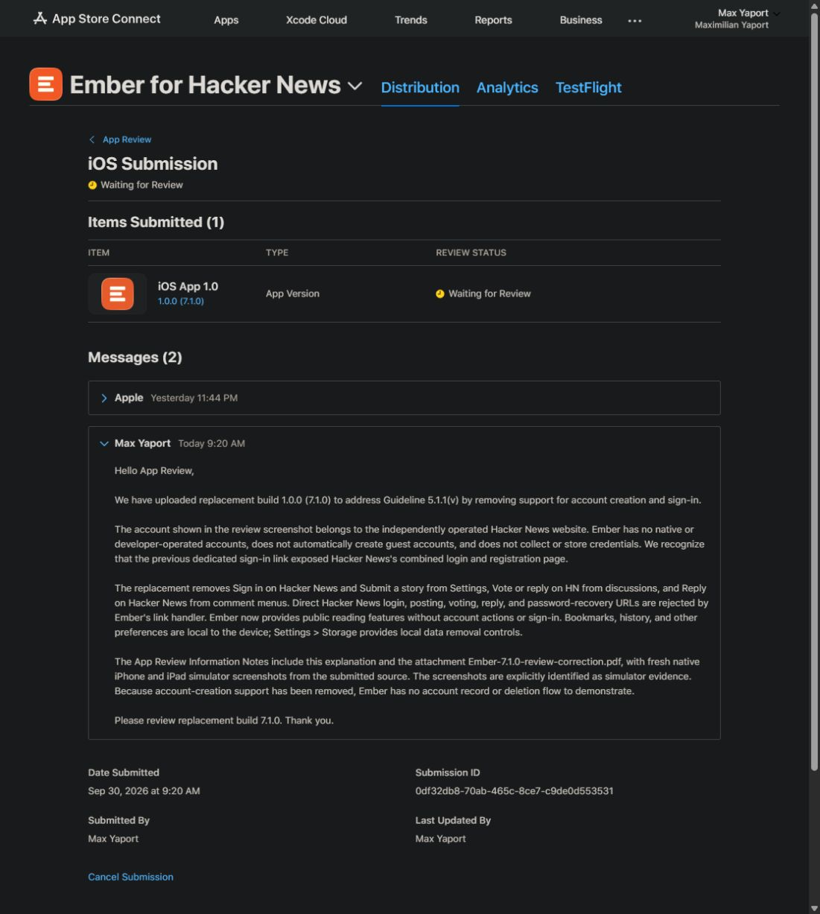
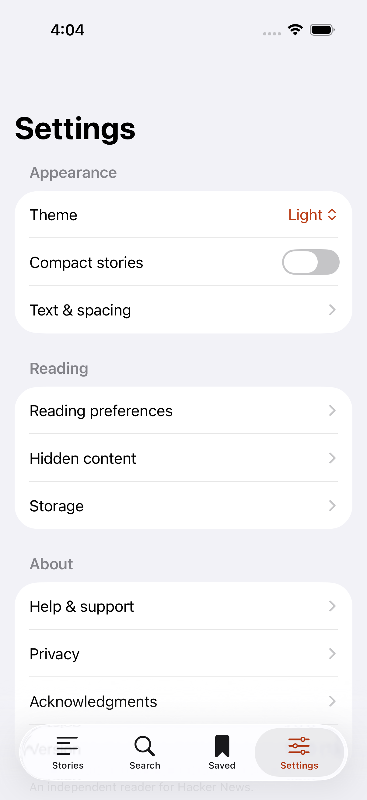
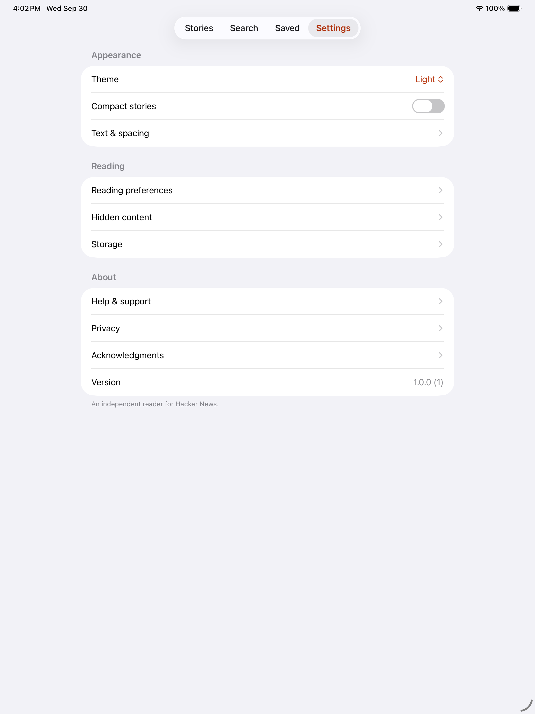
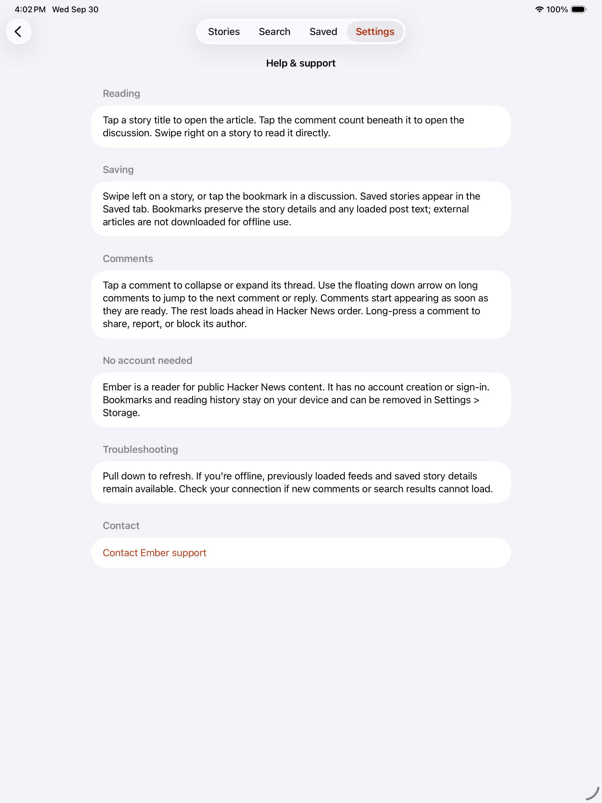
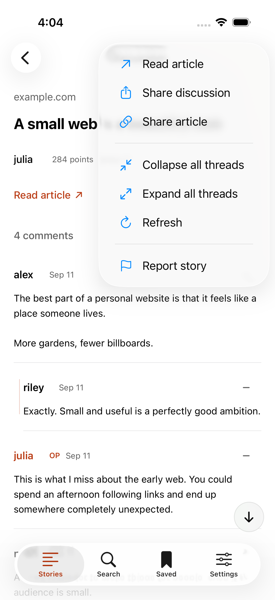
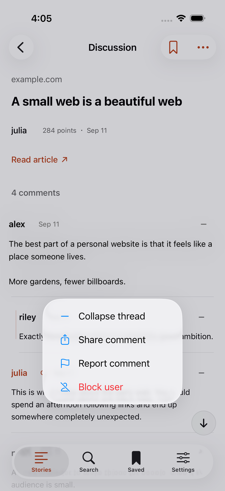

# Account creation review correction

September 30, 2026. Source `48ac2f5ff1255472e3226ca9607790f7cd1f267c`. Release build **1.0.0 (7.1.0)**.

**Resubmitted September 30, 2026 at 9:20 AM PDT.** Apple confirms **Waiting for Review** for build 7.1.0, submission `0df32db8-70ab-465c-8ce7-c9de0d553531`. The correction PDF is attached to App Review Information, and the explanation was sent in the review conversation.

Apple rejected build 6.1.0 under Guideline 5.1.1(v). Ember has no developer-operated accounts, but the former Hacker News sign-in shortcut opened HN's combined login-and-registration page. Apple's review screenshot shows an HN account in Apple's browser. The replacement removes dedicated account support rather than inventing a deletion flow for a third-party account Ember does not control.

Removed Settings' Sign in on Hacker News and Submit a story buttons, the discussion menu's Vote or reply on HN action, and the comment menu's Reply on Hacker News action. Direct HN login, posting, voting, and password-recovery URLs are rejected by the link handler. Public reading, source links, articles, reporting, and local blocking remain available. Help, privacy, support, and the App Store description/review notes describe the resulting reader-only behavior.

## Fresh verification

- [Native iPhone/iPad tests](https://github.com/yaportmax/ember-hacker-news/actions/runs/36740455240): four targeted UI tests passed on each simulator. They cover account/posting action removal, bookmark persistence, reporting/blocking, and storage confirmation. The iPhone job also passed 41 core/live API tests.
- [Signed Release build and Apple upload](https://github.com/yaportmax/ember-hacker-news/actions/runs/36740880373): the same 41 core/live API tests passed, signing and archive verification passed, and Apple processed build 7.1.0 as VALID. This export is not internal-only. [Upload record](../../Release/testflight-7.1.0-upload.json).
- [Current store captures](https://github.com/yaportmax/ember-hacker-news/actions/runs/36740880367): iPhone and iPad capture tests passed.
- The committed source fingerprint matches the signed build record: `7e5a29bc69a519f5f79bb85264267d48740f7da203675c0c8afe764f1607d919`.

The captures below are native Debug simulator screenshots with deterministic sample content, compiled from the same source commit as the signed Release build. They are not physical-device recordings. Release launches use live data and build number 7.1.0; simulator captures retain the project default build number.

## Settings

## Help

## Discussion and comment menus

No account is needed to test the replacement build. Settings > Storage manages bookmarks, history, and cached feeds. Settings > Hidden content manages blocked authors and hidden stories.
