# Reading controls and feed review — September 13, 2026

Review of the running SwiftUI app on iPhone and iPad simulators, using direct XCTest screenshots and deterministic stories. Normal launches and Release use live Hacker News data.

## Changes

- The story title opens its article immediately; the metadata opens the discussion.
- Comment text and blank row space collapse the thread. The author remains a profile link, inline links remain links, and the plus/minus provides an explicit alternative. Collapsed rows contain only the author/time header.
- The full discussion is fetched before showing comments, with eight concurrent requests at most. Scrolling does not fetch more replies. HN order and visible children of removed/delayed comments are preserved.
- A small floating arrow jumps immediately to the next comment or reply. It follows the current reading position and disappears when all remaining comments fit on screen.
- Stories and comments have independent font, size, and spacing controls. The real story/comment components appear in a pinned preview; controls scroll separately. Landscape phone layouts place preview and controls beside one another.
- The large feed heading and chevron remain. A separate quiet time menu offers Live, Today, Past week/month/year, All time, and inclusive custom dates.
- Historical Top/Best/Ask/Show results use Algolia's points ranking, while New/Jobs use date order. Live feeds retain HN's ranking. Historical results are paginated archive searches, not past snapshots of the front page.
- More feeds contains Best Comments, New Comments, Comment Highlights, Active Discussions, Newest Ask/Show, Who Is Hiring, Launch HN, Classic, Second Chance, Invited to Repost, and newcomer stories/comments. These preserve HN's own listing order and pagination. Best Comments offers 24 hours, 48 hours, and a week.

## What the first native run caught

[First run](https://github.com/yaportmax/ember-hacker-news/actions/runs/34740503660), source `d1e76990830b787b5d52f44e262ecaded19512bc`:

- The author-position assertion, body collapse, direct article opening, automatic replies, profile navigation, and independent comment link all passed on both devices.
- The arrow did not appear on either device. Discussion content was moved to a lazy scroll stack; a subsequent run still found a missing arrow and a long-scroll stall, so measurement state updates were removed in favor of layout anchors.
- The typography walkthrough stopped on an incorrect accessibility selector (`Font` instead of the native picker). The picker now has a stable identifier. Its actual layout was inspected, including iPad and landscape.
- The largest text screenshot showed excessive space consumed by repeated section labels. The duplicate heading was removed and the ancillary preview label was kept compact. The preview body continues to respect the user's chosen text size.

The live listing check found that Who Is Hiring uses `submitted?id=whoishiring`, not a `/whoishiring` endpoint. The route was corrected and verified against the live page. All thirteen selected lists returned 30 listing IDs and a pagination link. [Recorded live checks](hn-lists.json).

## Second native run

[Run 34741321613](https://github.com/yaportmax/ember-hacker-news/actions/runs/34741321613), source `744f008bbbfb8412c7d39e41df065142950ca854`:

- All 36 portable/core/live API tests passed.
- Time periods, custom date application, Best Comments' 24-hour selection, and comment-to-discussion navigation passed on both devices. These screenshots were inspected directly.
- Large-text adjustment and landscape controls passed on both devices. The complete light/dark typography walkthrough passed on iPad.
- iPhone's main app walkthrough, bookmark persistence, and search passed. The first two iPad tests encountered simulator launch failures; the subsequent launches worked.
- Long-comment scrolling stalled on both devices. The new revision removes geometry changes written to view state while scrolling.
- The iPhone indentation adjustment returned to the parent Settings screen. The screen recording and touch event were inspected: it was an actual horizontal slider drag. Automatic preview scrolling during that gesture was removed.

## Third native run

[Run 34742339107](https://github.com/yaportmax/ember-hacker-news/actions/runs/34742339107), source `79e95d496209ad8978801e3d36752b962d0881c2`:

- All 36 core/live API tests passed again.
- The complete typography walkthrough passed on both devices in light and dark mode, including font, size, indentation, scrolling the controls with the preview still visible, and resetting settings.
- Large accessibility text and landscape adjustment passed on both devices.
- The complete reading interaction passed on iPhone. On iPad, the arrow appeared and accepted the tap, but animated scrolling stalled. The jump was changed to be immediate.
- Visual inspection of the iPhone capture also showed the arrow remaining when every remaining reply already fit on screen. The arrow now hides in that case.

## Final reading check

[Run 34742954213](https://github.com/yaportmax/ember-hacker-news/actions/runs/34742954213), source `738a25024f1a6f5b859b64305946aae09f2239a8`:

The targeted reading interaction passed on both iPhone and iPad. This covers opening an article directly, opening its discussion independently, retaining author position on collapse, hiding the body and descendants, expanding again, preserving profile and inline-link navigation, jumping past a long comment, and hiding the arrow at the end. The final change was limited to the jump interaction; the feed and typography controls from the earlier passing checks are unchanged.

## Native screenshots

The feed screenshots below are from the second run; the typography screenshots are from the third run. They are direct simulator captures, without retouching.

| Time controls | Best Comments |
| --- | --- |
| 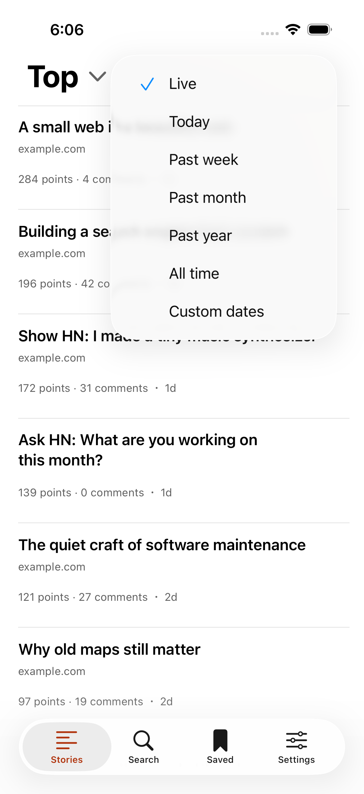 | 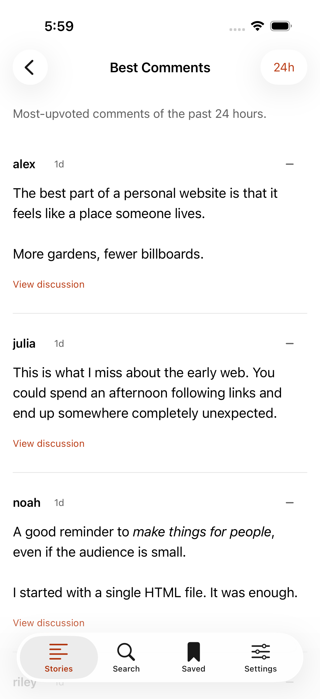 |
| 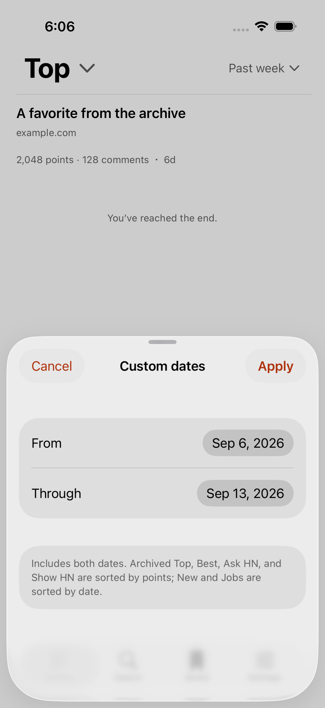 | 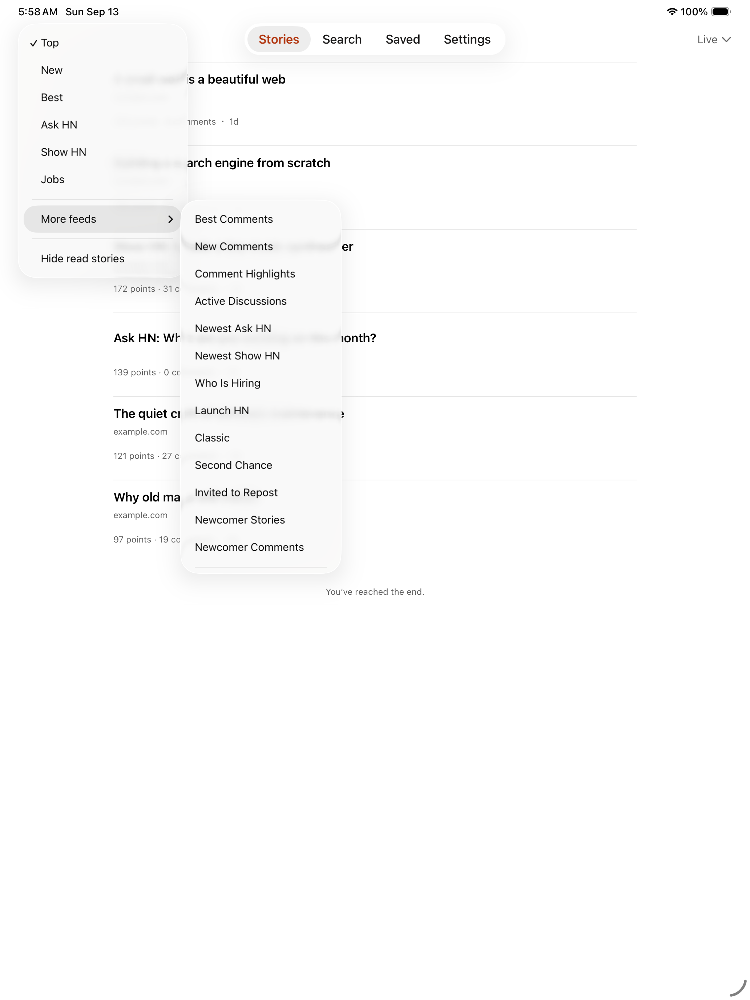 |

| Live preview, light | Live preview, dark |
| --- | --- |
| 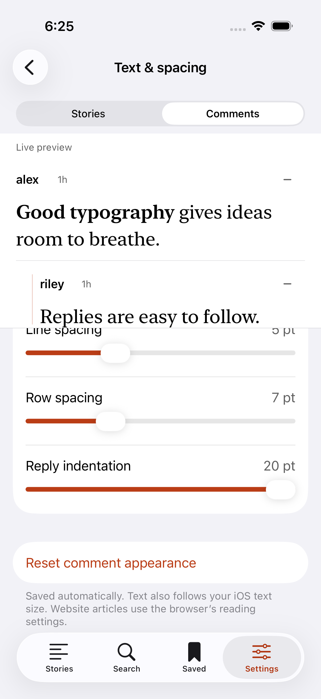 | 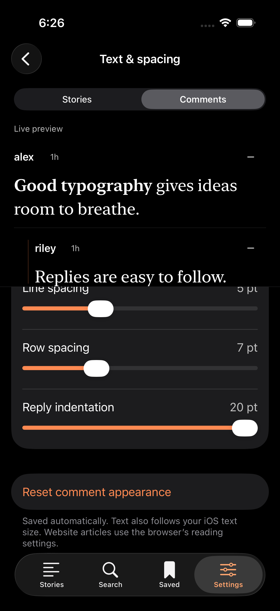 |

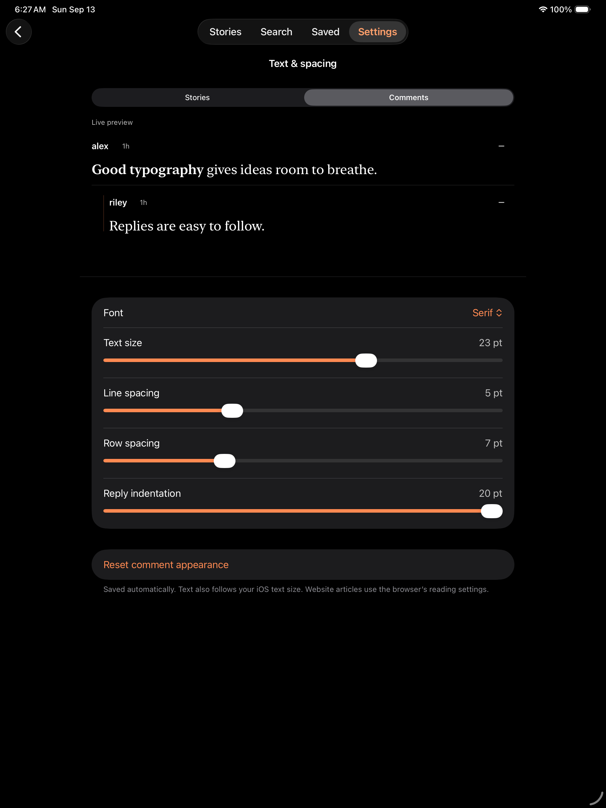

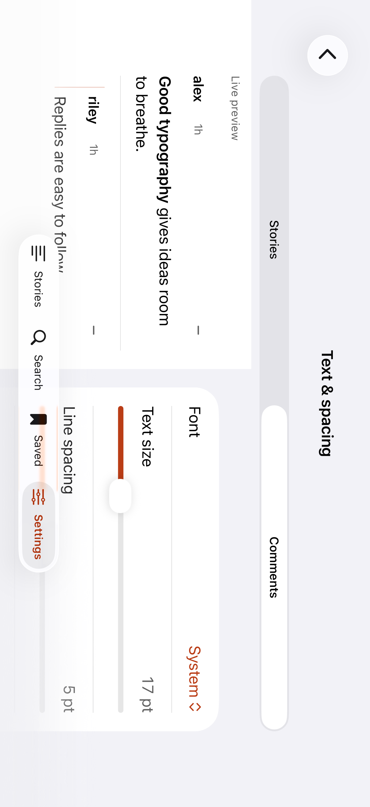

The following reading captures are from the final run on `738a25024f1a6f5b859b64305946aae09f2239a8`. Near the end of a discussion, the scroll position stops at the bottom of the content; the remaining replies are visible and the arrow disappears.

| Long comment with jump control | After jumping to the reply |
| --- | --- |
| 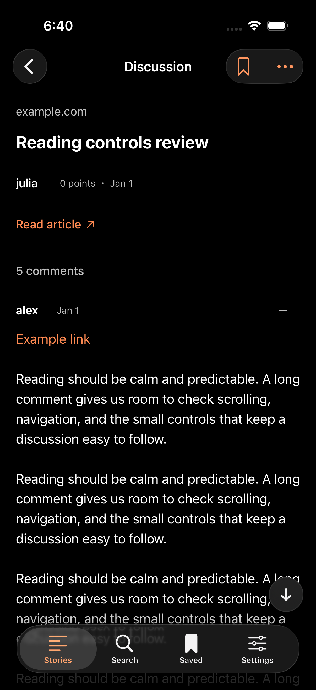 | 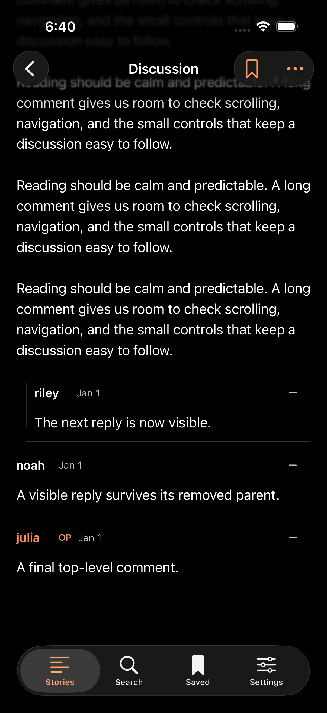 |

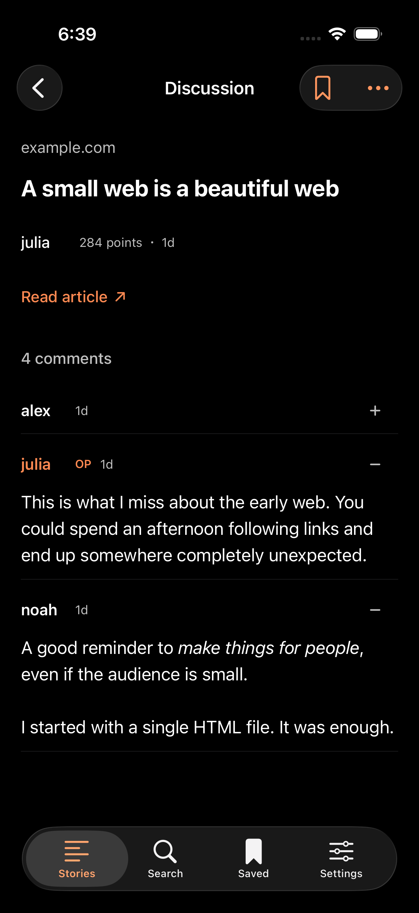

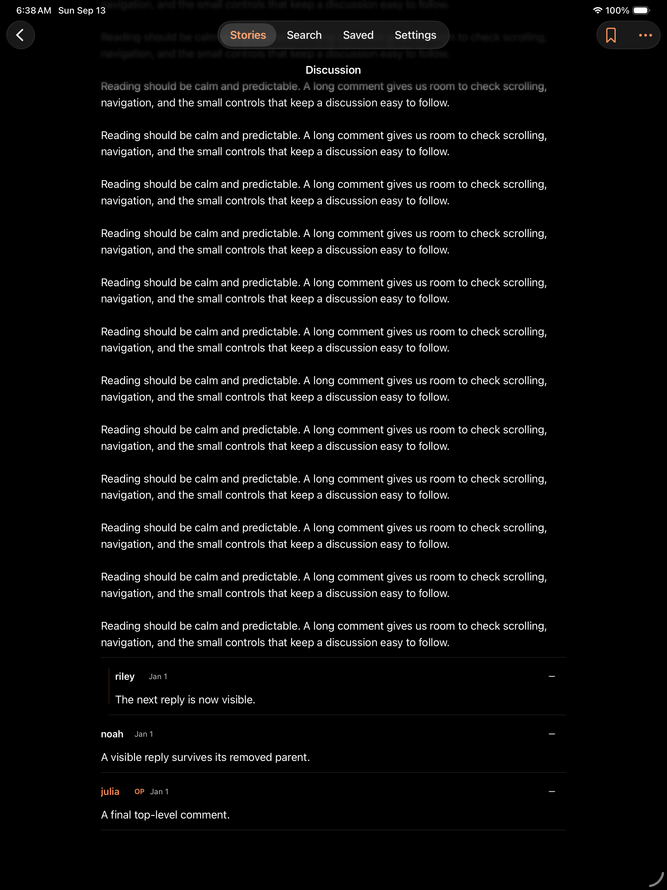

## Sources and boundaries

[HN's list directory](https://news.ycombinator.com/lists) documents the extra feeds. [Best Comments](https://news.ycombinator.com/bestcomments) documents its default 48-hour window and `h` parameter. [HN Search](https://github.com/algolia/hn-search) supplies the historical search index. HN-only lists have no Firebase listing endpoint, so Ember reads their public listing IDs and obtains the content from Firebase. Changes to HN's markup may require parser maintenance; an error offers retry and the original HN page.

This review covers these reading and feed changes. Simulator captures do not establish complete physical-device or VoiceOver coverage. App Store publication is separate from the private TestFlight build.
